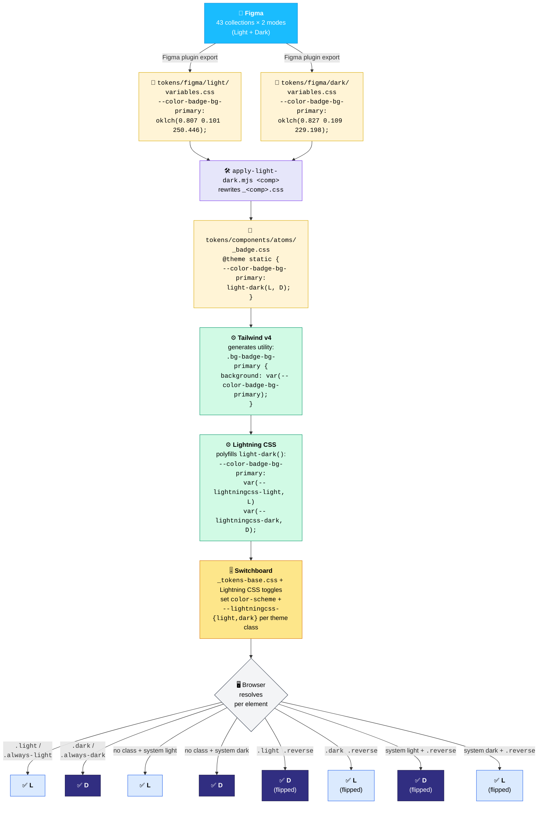
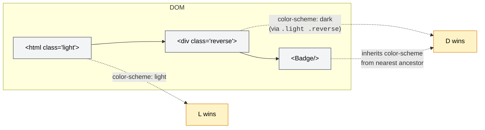
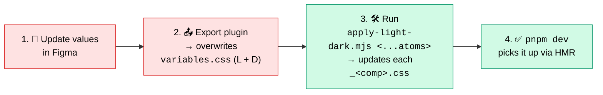

# Theme token flow (Figma → browser)

End-to-end path of a design token from the Figma source file to a rendered pixel in any of the three theme contexts (`light`, `dark`, `reverse`).

## Full pipeline

## Why this works for `.reverse`

The `.reverse` class doesn't carry any color values itself — it just flips `color-scheme` on the element. Lightning CSS's `light-dark()` polyfill follows the nearest `color-scheme`, so every migrated token automatically flips with no per-component CSS.

## When Figma changes

Three commands. The first is manual, the rest are scripted.

## File reference

| Layer | Path |
|---|---|
| Raw Figma export | `libs/ui/src/tokens/figma/{light,dark}/variables.css` |
| Per-component token files | `libs/ui/src/tokens/components/atoms/_<comp>.css` |
| Color-scheme switchboard | `libs/ui/src/tokens/_tokens-base.css` |
| Splitter (one-off inspection) | `.agents/skills/figma-token-binding/scripts/split-figma-tokens.mjs` |
| **Rebinder (canonical, run after each Figma export)** | `.agents/skills/figma-token-binding/scripts/apply-light-dark.mjs` |
| Skill doc | `.agents/skills/figma-token-binding/SKILL.md` |
