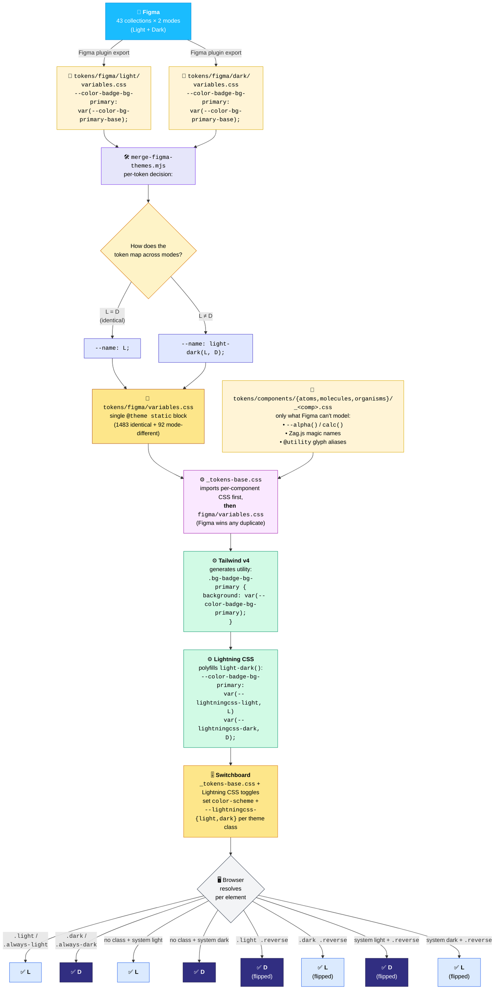
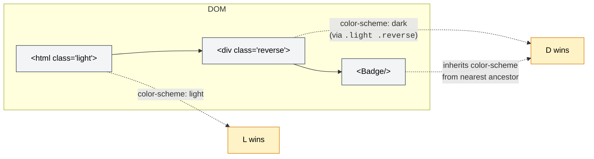
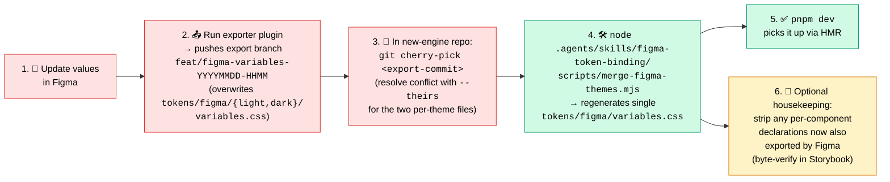

# Theme token flow (Figma → browser)

End-to-end path of a design token from the Figma source file to a rendered pixel in any of the three theme contexts (`light`, `dark`, `reverse`).

## Pattern at a glance

**Figma is the single source of truth for every token value.** Per-component CSS files (`tokens/components/atoms/*.css`, `tokens/components/molecules/*.css`) only declare what Figma does not model — runtime-derived values (`--alpha()`, `calc()`), Zag.js magic names, and `@utility` glyph aliases.

The merged Figma export is imported **last** in `_tokens-base.css`, so any duplicate declaration upstream is overridden — i.e. dead code, safe to delete.

## Full pipeline

## Per-token merge rules (merge-figma-themes.mjs)

| Condition | Output | Example |
|---|---|---|
| L = D in Figma export (most tokens) | single value | `--color-badge-fg-primary: var(--color-fg-primary);` |
| L ≠ D in Figma export | `light-dark(L, D)` | `--color-badge-bg-info: light-dark(oklch(0.704…), oklch(0.844…));` |
| Reference layer chains preserved end-to-end | `var(--ref)` | `--color-accordion-bg: var(--color-fill-surface);` |

The exporter emits proper `var(--target)` inheritance chains from the Figma variable graph. The merger only collapses light + dark per-theme files into one `@theme static` block — it does **not** flatten or resolve aliases.

## Per-component CSS — what stays there

Only declarations that cannot be modelled as static Figma variables:

| Reason kept | Example file | Example declaration |
|---|---|---|
| `--alpha()` runtime function | `_textarea.css` | `--color-textarea-placeholder-danger: --alpha(var(--color-textarea-border-danger-base) / var(--opacity-placeholder));` |
| `calc()` runtime function | `_checkbox.css` | `--spacing-checkbox-indeterminate-icon: 60%;` |
| Zag.js requires fixed CSS variable name | `_tooltip.css` | `--tooltip-arrow-size: var(--spacing-tooltip-arrow);` |
| `@utility` semantic glyph alias | `_icon.css`, `_status-text.css` | `@utility token-icon-success { @apply icon-[mdi-light--check-circle]; }` |
| Code-side name aliasing Figma name | `_checkbox.css` | `--spacing-form-checkbox-gap: var(--spacing-form-checkbox);` (TSX uses `gap-form-checkbox-gap`, Figma exports `--spacing-form-checkbox` without `-gap`) |

Everything else — color, border-width, padding, radius, text size, ring, validation — is owned by Figma and the per-component file must **not** redeclare it.

## Why this works for `.reverse`

The `.reverse` class doesn't carry any color values itself — it just flips `color-scheme` on the element. Lightning CSS's `light-dark()` polyfill follows the nearest `color-scheme`, so every Figma token automatically flips with no per-component CSS.

## When Figma changes

Three steps. Steps 1–2 happen in the Figma exporter repo; step 3 is local.

The cherry-pick conflict is expected — the two per-theme files have always-different content across exports (at minimum the `Exported at:` timestamp). Take `--theirs` unconditionally.

The merger is idempotent. Re-running it without a Figma change is a no-op.

The optional housekeeping step (6) is the "strip" pattern: if a per-component CSS file declares a token that the latest Figma export also exports, the per-component declaration is dead (Figma wins the cascade) and should be deleted. Verify with Storybook byte-comparison per component before deleting.

## Token value rules (8-point grid, locked 2026-06-12)

All dimension values in Figma (spacing, padding, gap, size, height, width,
radius) follow a clean even-number grid so the system stays easy to reason
about and compute with:

| Rule | Values |
|---|---|
| Preferred (8-pt steps) | `2, 4, 8, 16, 24, 32, 40, 48, 56, 64, 72…` (+ 4-pt half-steps `12, 20`) |
| Allowed fallback | any even number (`6, 10, 14, 18, 22, 28, 34…`) |
| Forbidden | odd numbers and decimals — round to nearest even (15 → 16, 25 → 24, 35 → 36, 45 → 44) |
| Exceptions | border widths (1/2/3px valid), `radius/full` (9999), containers (320–672), typography, durations, opacities |

**Consistency rule:** components in one family share input tokens. The form
family (input, select, combobox, numeric-input, textarea, search-form,
phone-input) inherits `border-width 2`, `radius sm/md/lg = 4/8/12`, heights
`32/44/72` from the shared `form-control` collection — never fork these
per component.

**Primitive names are pixel-true** (`dimension/16` = 16px). To change a
value, re-alias consumers to the correct primitive and delete the wrong
one; never make a primitive's value disagree with its name.

The same rules are enforced for new components by
`.agents/skills/component-to-figma/SKILL.md` (rule 11).

## File reference

| Layer | Path |
|---|---|
| Raw Figma export (per theme) | `libs/ui/src/tokens/figma/{light,dark}/variables.css` |
| **Merged Figma source of truth** | `libs/ui/src/tokens/figma/variables.css` |
| Per-component supplementary tokens | `libs/ui/src/tokens/components/{atoms,molecules,organisms}/_<comp>.css` |
| Cascade order + color-scheme switchboard | `libs/ui/src/tokens/_tokens-base.css` |
| **Merger (run after each Figma cherry-pick)** | `.agents/skills/figma-token-binding/scripts/merge-figma-themes.mjs` |
| Splitter (one-off inspection) | `.agents/skills/figma-token-binding/scripts/split-figma-tokens.mjs` |
| Reverse-apply helper (legacy / per-component rewriting) | `.agents/skills/figma-token-binding/scripts/apply-light-dark.mjs`, `apply-reverse-blocks.mjs` |
| Skill doc | `.agents/skills/figma-token-binding/SKILL.md` |

## Real-world examples in this PR

| Pattern | Where |
|---|---|
| `var(--ref)` inheritance from Figma | `figma/variables.css`: `--color-accordion-bg: var(--color-fill-surface);` |
| `light-dark(L, D)` mode-different | `figma/variables.css`: 92 such tokens |
| Per-component `--alpha()` derived | `_textarea.css`: `--color-textarea-bg-borderless` |
| Per-component `calc()` derived | `_checkbox.css`: `--spacing-checkbox-indeterminate-icon` |
| Per-component Zag.js magic name | `_tooltip.css`: `--tooltip-arrow-size`, `--tooltip-arrow-background` |
| Per-component code-side alias | `_checkbox.css`: `--spacing-form-checkbox-gap: var(--spacing-form-checkbox);` |
| Per-component `@utility` glyph alias | `_icon.css`, `_status-text.css` |
